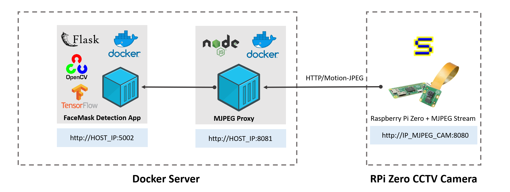
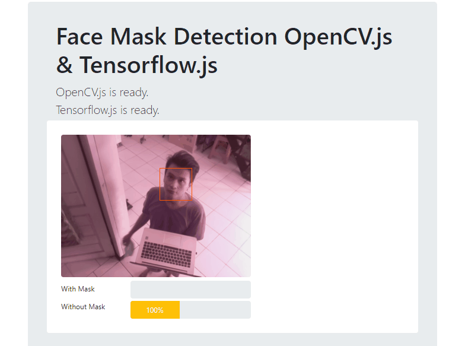

# Docker-FaceMask-TFJS-OpenCVJS
### Docker Facemask Detection using Tensorflow JS and OpenCV JS


- Install MJPEG Streamer in Raspberry Pi : 
[https://github.com/jacksonliam/mjpg-streamer](https://github.com/jacksonliam/mjpg-streamer)
- Pull & Run NodeJS MJPEG Proxy Server Docker Container :
[https://github.com/Muhammad-Yunus/docker-mjpeg-proxy](https://github.com/Muhammad-Yunus/docker-mjpeg-proxy)

- Create Self-Sign-Certificate inside directory `face_mask_app/CERT/`:
    ```
    cd Docker-FaceMask-TFJS-OpenCVJS/face_mask_app/CERT/
    openssl req -x509 -newkey rsa:4096 -nodes -out cert.pem -keyout key.pem -days 365
    ```
- Build Face Mask Detection App using Docker Compose :
    ```
    cd Docker-FaceMask-TFJS-OpenCVJS
    docker-compose -f "docker-compose.yml" up -d --build
    ```
- Access the App in URL : [https://HOST_IP:5002/](https://HOST_IP:5002/)
- Result : <br>
    
